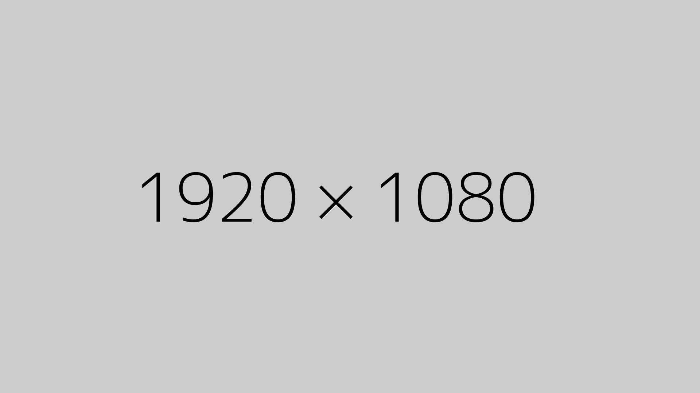

<!-- PROJECT SHIELDS -->

[](https://github.com/ZouariOmar/AgriGO/graphs/contributors)
[](https://github.com/ZouariOmar/AgriGO/network/members)
[](https://github.com/ZouariOmar/AgriGO/stargazers)
[](https://github.com/ZouariOmar/AgriGO/issues)
[](LICENSE)
[](https://www.linkedin.com/in/zouari-omar-143239283)

<h1 align="center">
  <br>
  <a href="https://github.com/ZouariOmar/Astra"></a>
  <br>
  Astra
  <br>
</h1>

<h4 align="center">A cross-platform desktop application designed to streamline shopping mall operations by integrating various services, including employee management. It also features facial recognition authentication for secure access.</h4>

<p align="center">
  <a href="#"></a>
  <a href="#"></a>
  <a href="#"></a>
  <a href="#"></a>
  <a href="#"></a>
  <a href="#"></a>
</p>

<p align="center">
  <a href="#key-features">Key Features</a> •
  <a href="#how-to-use">How To Use</a> •
  <a href="#download">Download</a> •
  <a href="#credits">Credits</a> •
  <a href="#related">Related</a> •
  <a href="#license">License</a>
</p>



## Key Features

- **Cross-Platform GUI**
  - Built with Qt6, providing a seamless experience on Windows, macOS, and Linux.
- **Modular Architecture**
  - Flexible integration of C++ and Qt6 for optimal performance.
- **Offline Support**
  - Operate without an active internet connection.
- **Facial Recognition Authentication**
  - Secure login system using OpenCV (cv2) for face recognition.

## How To Use

To clone and run this application, you'll need [Git](https://git-scm.com), [C++](https://isocpp.org/), and [Qt6](https://www.qt.io) installed on your computer. From your command line:

```bash
# Clone this repository
$ git clone https://github.com/ZouariOmar/Astra

# Go into the repository
$ cd Astra

# Install requirements
$ ./downloads/requirements.sh

# Build the C++ components
$ ./run.sh ninja build --root

# Run the app
$ ./run.sh ninja run
```

## Download

You can [download](https://github.com/ZouariOmar/Astra/releases) the latest installable version of Astra for Windows, macOS, and Linux.

## Emailware

Astra is an [emailware](https://en.wiktionary.org/wiki/emailware). Meaning, if you liked using this app or it has helped you in any way, I'd like you to send me an email at <zouariomar20@gmail.com> about anything you'd want to say about this software. I'd really appreciate it!

## Credits

This software uses the following open source packages:

- [Qt6](https://www.qt.io)
- [CMake](https://cmake.org)
- [OpenCV (cv2)](https://opencv.org)

## You may also like

- [QRME](https://github.com/ZouariOmar/QRME) - A QR code generator app
- [Tic Tac Toe](https://github.com/ZouariOmar/Tic-Tac-Toe) - A classic game built with SDL and C++

## License

MIT

---

> Linkedin [Zouari Omar](https://www.linkedin.com/in/zouari-omar-143239283) &nbsp;&middot;&nbsp;
> GitHub [@ZouariOmar](https://github.com/ZouariOmar) &nbsp;&middot;&nbsp;
